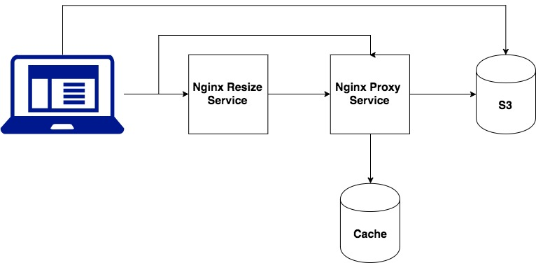

# 宿主主機 Nginx 設定

## Config

```
server {
  listen 80;
  # 假設主網域為 yep.com.tw
  server_name images.yep.com.tw;
  
  # 圖片代理伺服器導向
  location ~ .(png|gif|ico|jpg|jpeg)$ {
    proxy_pass http://127.0.0.1:8080;
  }

  # 預設首頁導向
  location / {
    proxy_pass https://www.yep.com.tw;
  }
}
```

# AWS S3 Proxy 設定

## Step 1. 建立 Image

透過本專案 `dockerfile` 建立 Image。

```
git clone <URL> <local>
docker build -t <image name> <local>
```

接下來可以喝杯咖啡等待 `Image` 建立完成。

## Step 2. 建立 Container

```
docker run -d -it -p <host port>:<container port> --name=<container name> <image name>
```

## Step 3. 設定 Container

### 將 `nginx` 設定檔複製到 Container 內

```
docker cp <local>/config/image <container name Or container id>:/etc/nginx/sites-available/image
```

### 進入容器

```
docker exec -it <container name Or container id> bash
```

### 新增快取資料夾

```
mkdir -p /var/nginx/cache/aws
```

預設位置是 `/var/nginx/cache/aws` 如果要異動，一併要修改 `config\image`。


### 設定軟連結

```
ln -s /etc/nginx/sites-available/image /etc/nginx/sites-enabled/image
```

### 重啟 Nginx 服務

```
service nginx restart
```

### 關於快取資料夾設定

```
proxy_cache_path  /var/nginx/cache/aws  levels=2:2:2 use_temp_path=off keys_zone=aws:2048m inactive=30d max_size=100g;
```

`config/image` 第一行設定是 proxy AWS S3 快取資料夾，預設為 `/var/nginx/cache/aws`，可以自訂義，修改之後一併要檢查系統有無此資料夾。

### 關於快取空間設定

參考 `nginx` 設定說明：
 
[http://nginx.org/en/docs/http/ngx_http_proxy_module.html#proxy_cache_path](http://nginx.org/en/docs/http/ngx_http_proxy_module.html#proxy_cache_path)

#### 相關說明

```
proxy_cache_path  /var/nginx/cache/aws  levels=1:2 use_temp_path=off keys_zone=aws:1024m inactive=30d max_size=100g;
```

**/var/nginx/cache/aws** : 本地路徑，快取文件存放位置；

**levels** : 預設所有快取文件都放在同一个/path/to/cache下，從而影響快取的效能，大部分使用2级目錄來暫存文件；

**key_zone** : 在共享快取中設置存取區域來存放快取的 `key`和 `metadata`（類似使用次数），這樣 `nginx` 可以快速判斷一个 `Request` 是否符合快取，1m 可以儲存 8000 個 key，10m 可以儲存 80000 個 key；

**max_size** : 最大 cache 空間，如果不指定，預設為無限大（直到空間用盡），如果滿了會删除最少使用的 cache 文件；

**inactive** : 久未被請求的文件在快取中保留時間，預設10分钟；需要注意的是，inactive 和 expired 配置项的含义是不同的，expired 只是快取過期，但不会被删除，inactive 是删除久未被請求的文件；

**use_temp_path** :  如果為off，則 nginx 會將快取文件直接寫入指定的 cache 文件中，而不是使用 temp_path 存儲，official 建議為 off，避免檔案在不同文件系统中不必要的複製；

## 架構與服務說明

本代理服務，透過 `nginx` Proxy Pass 功能代理與快取 AWS S3 檔案，提供 `Resize` 功能。

Client 可以透過代理服務取得 S3 的檔案，而代理伺服同時會將此檔案暫存快取，當 Client 再次請求相同的檔案，Nginx Cache 的機制會從快取中取得並回傳，進而節省對 S3 的請求流量，如果 Cliet 是以 Resize 的方式是請求，Resize 的服務則是向 Nginx Proxy 請求，而不是直接向 S3，主要也是透過希望透過快取方式來進行。



### 代理服務

原 AWS S3 Url：

```
<Protocol>://<AWS S3 Url>/<bucket>/85f38ab0-818f-11e7-a734-934facaaf741.jpeg
```

經 `nginx` 代理服務 Url：

```
<Protocol>://<Proxy Host>:<Port>/unsplash.iyp.tw/85f38ab0-818f-11e7-a734-934facaaf741.jpeg
```

### Resize 功能

設定寬度與高度，`nginx` 會透過參數進行處理，如果設定寬度與高度超過原圖片尺寸，Resize 功能將不會作動，反之，則會作動。

```
<Protocol>://<Proxy Host>:<Port>/resize/<width>x<height>/<bucket>/85f38ab0-818f-11e7-a734-934facaaf741.jpeg
```


